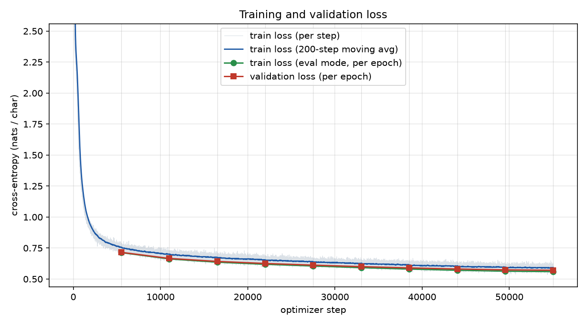

# Task 1 — GPT-style character-level LLM from scratch · Shibin Thomas

Character-level, decoder-only Transformer (GPT) trained from scratch on my own 100K / 10K split of
TinyStories. Every Transformer component (LayerNorm, multi-head causal self-attention, FFN, residual
blocks) is hand-written in [`src/model.py`](src/model.py); no prebuilt Transformer/attention module is used
(enforced by [`tests/test_model.py`](tests/test_model.py)).

| | |
|---|---|
| Config | [`configs/gpt_char_v1.yaml`](configs/gpt_char_v1.yaml) |
| Code / notebook | [`src/`](src/) · [`src/task1_gpt_tinystories.ipynb`](src/task1_gpt_tinystories.ipynb) |
| Metrics (all) | [`metrics_report.csv`](metrics_report.csv) |
| Failure analysis | [`failure_analysis.md`](failure_analysis.md) |
| Plots / samples | `outputs/gpt_char_v1_20261001-153007/loss_curves.png`, `grad_norm.png`, `lr_schedule.png`, `samples.md` |
| Raw logs / manifest | `reproducibility/raw_logs/task1_llm/shibin_thomas/<run_id>/`, `reproducibility/manifests/task1_llm/shibin_thomas/<run_id>.json` |
| Checkpoint | `checkpoints/<run_id>/best_model.pt` (epoch with the lowest validation loss) |

## 1. Data preprocessing (1.1)

| Step | What I did | Why |
|---|---|---|
| Load | HF `roneneldan/TinyStories` train split, streamed to a shared JSONL file (`task1_llm/data/`) | one raw copy for the team, identical line order for everyone |
| Clean | typographic unicode → ASCII (’ “ ” — … → ' " " - ...), whitespace normalised; stories still containing non-ASCII characters or shorter than 50 chars are dropped. **Result:** of 2,119,719 raw stories, 1,989,367 kept; 130,115 dropped as non-ASCII (6.1%); 237 dropped as too short; 0 malformed (`data_processed/main/meta.json`) | keeps the vocabulary at **90 symbols** (88 characters + `<eos>` + `<unk>`) instead of hundreds of rare symbols the model could never learn well; 0 unknown characters in validation |
| Own split | 100,000 train + 10,000 validation stories sampled **without replacement** from the clean pool with my own seed (`split_seed: 266`); raw line indices saved in `data_processed/main/split_indices.npz` | disjoint by construction, exactly reproducible, different from teammates' splits |
| Tokenise | character level; `char_to_idx` / `idx_to_char` built from the **training split only** (`data_processed/main/vocab.json`); `0 = <eos>`, `1 = <unk>` | `<eos>` marks story boundaries so the model learns to end stories; `<unk>` covers a validation char unseen in training (count reported in meta.json) |
| Encode | each story → integer ids + `<eos>`, concatenated into one `uint8` stream per split (`train.bin` 90,162,497 chars, `val.bin` 8,956,317 chars; mean story length 901 chars) | compact, whole split fits in GPU memory → no data-loader bottleneck |
| Sequences | fixed-length windows of 256 chars: `x = s[i:i+256]`, `y = s[i+1:i+257]` (`CharStream` in `src/data_prep.py`; examples in `data_processed/main/example_sequences.txt`) | standard next-token objective: every position predicts the following character |

**Epoch definition.** Each epoch cuts the training stream into non-overlapping 256-char windows starting at a random
offset in [0, 256), shuffles them and iterates once — every training character is a prediction target once per epoch
(up to the last incomplete batch), and the window boundaries differ every epoch.

## 2. Model architecture (1.2)

```
ids (B, 256) ─► token embedding (V×320) + learned positional embedding (256×320) ─► dropout
             ─► 6 × [ x = x + MultiHeadCausalSelfAttention(LayerNorm(x))      8 heads × 40 dims
                      x = x + FeedForward(LayerNorm(x)) ]                     320 → 1280 → 320, GELU
             ─► LayerNorm ─► LM head Linear(320 → V)  (weights tied to the token embedding)
             ─► logits (B, 256, V) ─► cross-entropy with targets shifted by one
```

* **Multi-head self-attention**: one fused linear layer produces Q, K, V; reshaped to 8 heads;
  `softmax(QKᵀ / √40 + M) V`; heads concatenated; output projection; dropout on attention weights and output.
* **Causal masking**: `M` is a lower-triangular boolean buffer; scores of future positions are set to −∞ before
  the softmax, so position *t* only attends to positions ≤ *t*. Verified by a test that perturbs future
  characters and checks that earlier logits are bit-identical, and by checking the attention matrix is
  lower-triangular with rows summing to 1.
* **LayerNorm** written by hand (mean/variance over the feature dimension, learnable γ/β, computed in fp32);
  matches `F.layer_norm` to 1e-5 in the tests (used only as a reference there).
* **Residual connections** around both sub-layers (pre-LN layout).
* **Parameter count**: 7,509,120 total (7,398,400 non-embedding).

## 3. Hyperparameters and justification

| Hyperparameter | Value | Justification |
|---|---|---|
| Context length `block_size` | 256 chars | ≈ 45–50 words, i.e. several TinyStories sentences — enough to keep names and the current event in view, while attention cost (∝ T²) stays cheap. |
| Layers / width / heads | 6 / 320 / 8 (head dim 40) | ~7.5 M parameters. 10 epochs × 90.2 M training characters (`data_processed/main/meta.json`) = 0.90 B training tokens ≈ 120 tokens per parameter, so the model is data-rich (low over-fitting risk) yet trains in 29 minutes on one RTX 5090. The TinyStories paper shows models of only a few million parameters already produce fluent stories. 8 heads let different heads specialise (e.g. previous character, word start, quote matching). |
| FFN expansion | 4× (1280), GELU | standard GPT ratio; GELU is the smooth activation used by GPT-2. |
| Layout | pre-LayerNorm | more stable gradients than post-LN (Xiong et al., 2020); trains reliably with a short warm-up. |
| Weight tying | on | input and output character representations share one matrix (Press & Wolf, 2017); small saving at char level, but a cleaner, more regularised model. |
| Dropout | 0.1 | mild regularisation; with ~120 tokens/parameter heavy dropout would only slow learning. |
| Initialisation | N(0, 0.02); residual output projections scaled by 1/√(2·n_layer) | GPT-2 scheme: keeps the residual-stream variance constant with depth, initial loss ≈ ln V. |
| Optimiser | AdamW, β = (0.9, 0.95), ε = 1e-8, weight decay 0.1 (matrices/embeddings only) | standard for Transformers; β₂ = 0.95 reacts faster to gradient-scale changes; no decay on biases/LayerNorm gains. |
| Peak LR / floor | 6e-4 → 6e-5 | 6e-4 is a well-tested peak for models of this size; the floor at 10% keeps learning in the last epochs. |
| **LR warm-up + schedule** | linear warm-up over the first 2% of steps (~1.1 K), then cosine decay | warm-up avoids large, noisy Adam updates while the second-moment estimates are still poor; cosine decay gives fast early progress and fine convergence at the end. Plot: `outputs/<run_id>/lr_schedule.png`. |
| Batch | 64 × 256 = 16,384 characters per step | good GPU utilisation for a 7.5 M model and smooth gradient estimates; 5,503 steps per epoch (55,030 in total). |
| Gradient clipping | global L2 norm 1.0 | guards against loss spikes; pre-clip norms logged every step for the stability analysis. |
| Epochs | 10 | the brief's minimum; best checkpoint chosen by validation loss. |
| Precision | bf16 autocast on Ampere+ GPUs (fp16 + GradScaler on older GPUs) | ~2× faster, lower memory; attention softmax, LayerNorm statistics and the loss are computed in fp32. |
| Generation | greedy and temperature 0.8 sampling, 500 new chars, shared prompts | greedy shows the model's mode (and its repetition tendency); T = 0.8 trades a little diversity for coherence. |

## 4. Metrics

All metrics come from the best checkpoint, and are written by `src/evaluate.py` to `metrics_report.csv`.
Definitions are the team's shared ones in `task1_llm/shared_eval/metrics.py`:
perplexity = exp(CE), BPC = CE / ln 2, generalisation gap = val CE − train CE (train CE in eval mode, i.e. no dropout),
Distinct-n = unique / total word n-grams over all sampled continuations, repeated 4-gram rate = 1 − unique/total
word 4-grams within a continuation (averaged), gradient norm = pre-clip global L2 norm.

<!-- METRICS:START -->
_Auto-generated by `src/evaluate.py` from run `gpt_char_v1_20261001-153007` (source: `outputs/gpt_char_v1_20261001-153007/metrics_report.csv`)._

| Metric | Value | Notes |
|---|---|---|
| Training cross-entropy loss | 0.5594 | nats/char, eval mode, best ckpt |
| Training loss (running avg, last epoch) | 0.5918 | nats/char, with dropout |
| Validation cross-entropy loss | 0.5711 | nats/char, best ckpt |
| Perplexity (validation) | 1.7701 | exp(val CE), per char |
| Bits-per-character (validation) | 0.8239 | val CE / ln 2 |
| Perplexity (train) | 1.7497 | exp(train CE) |
| Bits-per-character (train) | 0.8071 | train CE / ln 2 |
| Generalization gap | 0.0116 | val CE - train CE (nats) |
| Top-1 next-character accuracy (validation) | 0.8173 | fraction |
| Top-1 next-character accuracy (train) | 0.8202 | fraction |
| Distinct-1 | 0.2277 | word level, sampled continuations |
| Distinct-2 | 0.7048 | word level, sampled continuations |
| Distinct-3 | 0.9264 | word level, sampled continuations |
| Repeated 4-gram rate | 0.0066 | mean per sample, sampled continuations |
| Distinct-1 (greedy) | 0.2008 | word level, greedy continuations |
| Distinct-2 (greedy) | 0.5392 | word level, greedy continuations |
| Distinct-3 (greedy) | 0.7191 | word level, greedy continuations |
| Repeated 4-gram rate (greedy) | 0.1373 | mean per sample |
| Gradient norm (mean, pre-clip) | 0.3039 | L2 |
| Gradient norm (p99, pre-clip) | 1.1454 | L2 |
| Gradient norm (max, pre-clip) | 14.7102 | L2 |
| Fraction of steps clipped | 0.0134 | grad norm > clip |
| Loss spikes | 0 | count; loss > 1.5 x EMA after warm-up |
| NaN / Inf steps | 0 | count |
| Parameter count | 7,509,120 | trainable, tied weights counted once |
| Parameter count (non-embedding) | 7,398,400 |  |
| Training tokens/sec | 569,917 | chars/sec, optimizer steps only |
| Generation tokens/sec | 254.9890 | chars/sec, batch 1, no KV cache |
| Peak GPU memory (allocated) | 3346.5425 | MB, training |
| Peak GPU memory (reserved) | 4166.0000 | MB, training |
| Peak CPU RSS | 2366.6172 | MB, training process |
| Total training time | 1735.7491 | seconds, wall clock incl. per-epoch eval |
| Total training time | 28.9292 | minutes |
| Epochs trained | 10 |  |
| Best epoch (lowest val loss) | 10 |  |
| Hardware | NVIDIA GeForce RTX 5090 | device used for training |
<!-- METRICS:END -->

## 5. Training curves and stability



| Epoch | 1 | 2 | 3 | 4 | 5 | 6 | 7 | 8 | 9 | 10 |
|---|---|---|---|---|---|---|---|---|---|---|
| Train CE (eval mode) | 0.713 | 0.662 | 0.636 | 0.619 | 0.605 | 0.592 | 0.580 | 0.571 | 0.563 | 0.560 |
| Validation CE | 0.715 | 0.666 | 0.642 | 0.625 | 0.612 | 0.600 | 0.590 | 0.581 | 0.574 | **0.571** |
| Validation accuracy | 77.4% | 78.8% | 79.6% | 80.1% | 80.5% | 80.8% | 81.2% | 81.4% | 81.6% | **81.7%** |

Source: `reproducibility/raw_logs/task1_llm/shibin_thomas/gpt_char_v1_20261001-153007/epochs.csv`.

**What the curves show**

* **Fast initial learning.** The training loss falls from 4.52 (≈ ln 90, a uniform guess over the 90-character
  vocabulary) to below 1.0 by step ~1,400, just after the 1,100-step warm-up. By then the model has learned
  character frequencies, common words and spacing.
* **Slow, steady improvement afterwards.** Validation CE falls every epoch, 0.715 → 0.571, so the best
  checkpoint is the last one (epoch 10). The improvement per epoch shrinks from 0.049 to 0.003.
* **Not fully converged.** Validation loss was still decreasing at epoch 10, so more epochs or a larger model
  would likely help further.
* **No over-fitting.** The generalisation gap (val − train CE, both in eval mode) stays tiny: it grows only
  from 0.003 to 0.012 nats. That is expected with 0.90 B training characters for 7.5 M parameters.
  * The running training loss (blue curve) lies *above* the validation loss because it is measured with
    dropout active and averaged over each epoch while the model was still improving. The eval-mode training
    loss (green) is the fair comparison.

**Training stability** (`grad_norm.png`, `train_steps.csv`)

* **No NaN/Inf steps and no loss spikes**, over all 55,030 steps.
* **All clipping happened during warm-up.** The pre-clip gradient norm peaked at 14.7 at step 0 (random
  initialisation). All 738 clipped steps (1.3%) fall inside the warm-up phase; the last one is step 1,090.
  After warm-up the clipping threshold of 1.0 was never reached.
* **Gradient norm after warm-up.** The mean norm is 0.39 in the rest of epoch 1, drops to 0.27 in epoch 2,
  and then slowly rises to 0.32 in epoch 10. The rise is normal as the learning rate decays and the loss
  approaches its floor.
* **Steady throughput.** Training ran at ~570 K characters/s on the RTX 5090 (bf16). The 10 epochs took
  28.9 minutes with 3.3 GB peak GPU memory.

## 6. Generated samples

All 40 samples are in [`outputs/gpt_char_v1_20261001-153007/samples.md`](outputs/gpt_char_v1_20261001-153007/samples.md)
(10 shared prompts × 1 greedy + 3 temperature-0.8 samples). A typical temperature-0.8 sample:

> **Once upon a time**, there was a girl named Lily. She had a big, brown dog named Max. Max was very friendly and
> loved to play with Lily. One day, Lily was playing in her room when she heard a loud noise. Max looked out the
> window and saw a butterfly in the sky.

**Quality**

* The model writes fluent, grammatical TinyStories-style English: named characters, dialogue in quotes,
  paragraph breaks, and simple cause and effect.

**Greedy vs sampled**

* Greedy decoding is safe but repetitive: repeated 4-gram rate 0.137, Distinct-2 0.54.
* Temperature-0.8 sampling is much more diverse: repeated 4-gram rate 0.007, Distinct-2 0.70, Distinct-3 0.93.
  The cost is occasional invented words and plot drift (see `failure_analysis.md`).

**Note on evaluation runs.** Evaluation ran twice on the same checkpoint: once in the pipeline and once when the
notebook was executed. Both runs are in `eval.log`. The loss and accuracy metrics are identical. The generation
metrics differ slightly between the two runs, because GPU computation is not bit-for-bit deterministic and
sampled text is sensitive to tiny numerical differences. `metrics_report.csv` holds the second (notebook) run.

## 7. How my model differs from my teammates'

| Member | Layers | d_model | Heads | Context | Params | Other differences |
|---|---|---|---|---|---|---|
| Shibin Thomas | 6 | 320 | 8 | 256 | 7.51 M | pre-LN, tied weights, cosine LR 6e-4, 2% warm-up, batch 64 |
| _teammate_ | | | | | | |

## 8. Hardware disclosure

Filled in automatically: the `Hardware` row of `metrics_report.csv` and the `hardware` section of the run manifest
(GPU model, GPU memory, CUDA / cuDNN versions, CPU model) record exactly where the model was trained.

## References
* Vaswani et al., *Attention Is All You Need*, NeurIPS 2017.
* Eldan & Li, *TinyStories: How Small Can Language Models Be and Still Speak Coherent English?*, 2023.
* Radford et al., *Language Models are Unsupervised Multitask Learners* (GPT-2), 2019.
* Xiong et al., *On Layer Normalization in the Transformer Architecture*, ICML 2020.
* Press & Wolf, *Using the Output Embedding to Improve Language Models*, EACL 2017.
* Li et al., *A Diversity-Promoting Objective Function for Neural Conversation Models* (Distinct-n), NAACL 2016.
