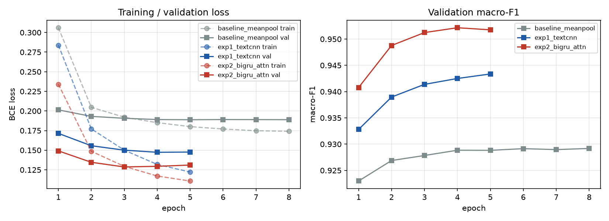
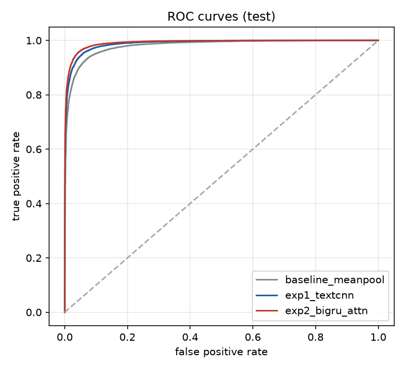
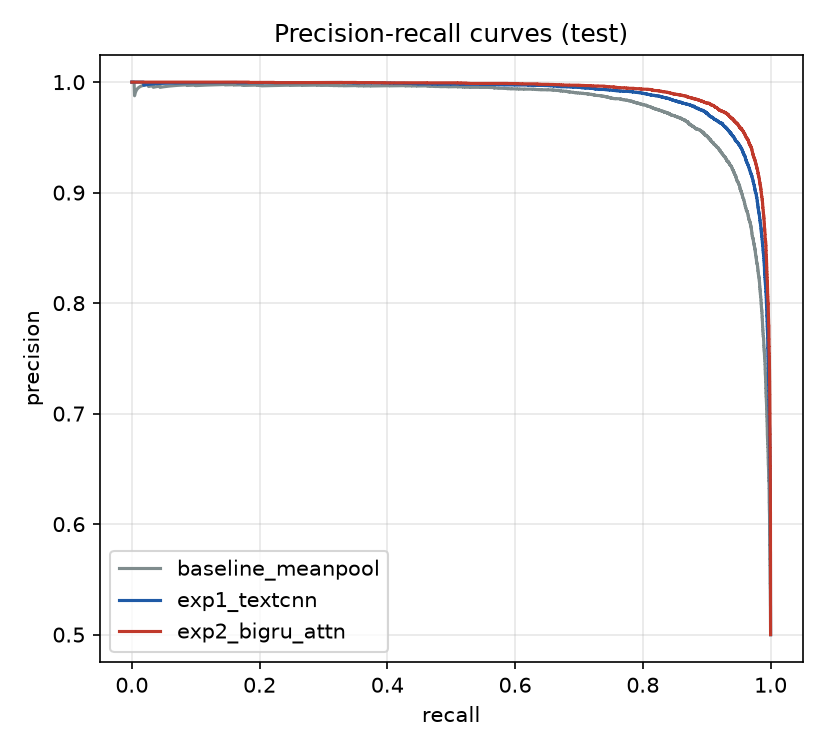
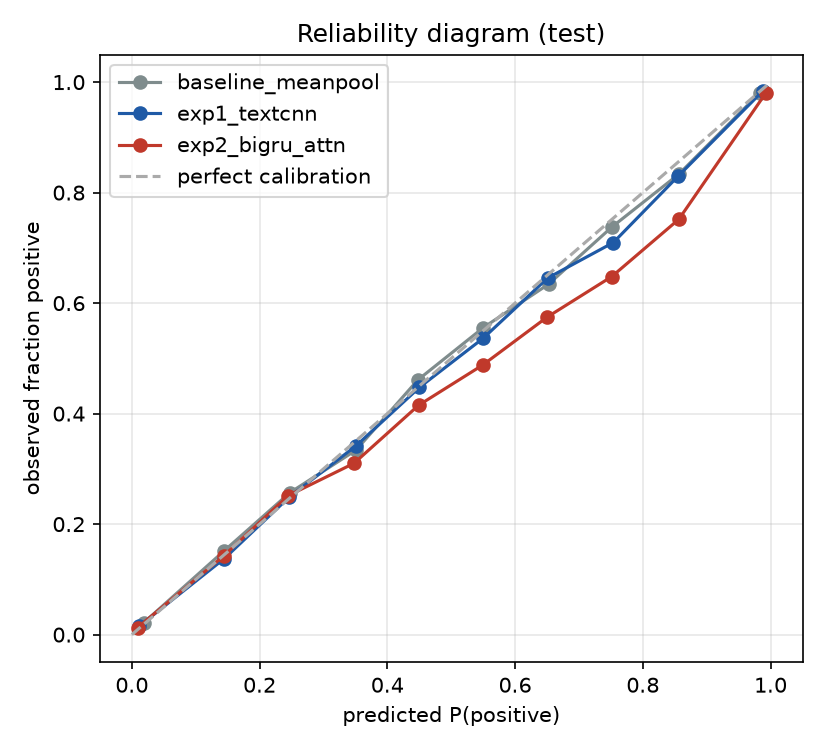
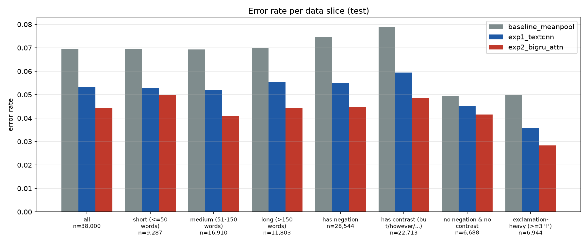

# Task 2 — Yelp Polarity sentiment classification · Shibin Thomas

Binary sentiment classification (0 = negative, 1 = positive) on Yelp Review Polarity with **no pretrained
embeddings or pretrained language models**. I built three models: a baseline and two experimental models.
All of them learn their word embeddings from scratch on my training split.

| | |
|---|---|
| Configs | [`configs/data.yaml`](configs/data.yaml), [`baseline_meanpool.yaml`](configs/baseline_meanpool.yaml), [`exp1_textcnn.yaml`](configs/exp1_textcnn.yaml), [`exp2_bigru_attn.yaml`](configs/exp2_bigru_attn.yaml) |
| Code / notebook | [`src/`](src/) · [`src/task2_yelp_sentiment.ipynb`](src/task2_yelp_sentiment.ipynb) |
| All metrics, all models | [`metrics_report.csv`](metrics_report.csv) · side by side: [`comparison.md`](comparison.md) |
| 20-error review | [`failure_analysis.md`](failure_analysis.md) |
| Plots | `outputs/<run_id>/` (ROC, PR, reliability, training curves, slices, confusion matrices) · EDA: `outputs/eda/main/` |
| Raw logs / manifest | `reproducibility/raw_logs/task2_sentiment/shibin_thomas/<run_id>/`, `reproducibility/manifests/task2_sentiment/shibin_thomas/<run_id>.json` |

## 1. Data analysis and preprocessing (2.1)

**Splits.** The official **test** split (38,000 reviews) is the test set, so it is identical for every team
member and our numbers are comparable. My **validation** set (50,000 reviews, stratified, seed 266) is carved
out of the official train split. It is used for early stopping and model selection, and never for testing.

<!-- DATA:START -->
_Auto-generated from `data_processed/main/meta.json`._

| Split | Reviews | Negative | Positive | Positive rate | Words mean | median | p95 | max |
|---|---|---|---|---|---|---|---|---|
| official train (cleaned) | 559,883 | 279,917 | 279,966 | 50.00% | 134.1 | 98 | 375 | 1052 |
| my train | 509,883 | 254,919 | 254,964 | 50.00% | 134.2 | 98 | 375 | 1052 |
| my validation | 50,000 | 24,998 | 25,002 | 50.00% | 133.1 | 98 | 371 | 1002 |
| official test | 38,000 | 19,000 | 19,000 | 50.00% | 133.6 | 98 | 371 | 1007 |

Class balance (minority / majority) = 1.000, i.e. essentially balanced - accuracy is meaningful and no re-weighting is needed. Negative reviews are on average 153 words long versus 116 for positive ones (medians 113 / 85).

**Missing / malformed entries.** Raw rows: train 560,000, test 38,000. Removed from train: 0 missing/non-string text, 0 invalid labels, 0 empty, 102 exact duplicates, 15 reviews also present in test. Removed from test: 0 missing, 0 invalid labels, 0 empty.

**Tokens.** After preprocessing: mean 66.5 tokens per review (median 49, p95 184); 1.77% of training reviews exceed max_len and are head+tail truncated; vocabulary 30,000 tokens; out-of-vocabulary token rate on test 0.71%; 37 training reviews became empty after stopword removal (encoded as a single <unk>).

**Sanity check (log-odds).** Most negative tokens: unprofession, rudest, unaccept, appal, incompet, disrespect, dishonest, worst, ined, unhelp, fraud, liar. Most positive tokens: unassum, scrumptious, mmmmm, divin, gem, yum, delish, drawback, exquisit, delect, downsid, breathtak.
<!-- DATA:END -->

EDA plots: `outputs/eda/main/class_distribution.png`, `length_distribution.png`, `token_length_vs_maxlen.png`.

### Evidence that the embeddings were learned from scratch (2.1.5)

Every embedding row starts as random noise, N(0, 1). After training, I listed the cosine nearest neighbours
of sentiment words in each model's learned embedding table, among the 20,000 most frequent stems. These come
from the committed checkpoints of run `yelp3_20261001-182849`, also saved in
`outputs/yelp3_20261001-182849/embedding_neighbours.md`.

| Query (stem) | Baseline (mean-pool) neighbours | BiGRU neighbours |
|---|---|---|
| great | notch, drawback, bonus, trifecta, happili, downsid | alexandra, wander, shenanigan, groov, chester, unadulter |
| terribl | tasteless, worst, overpr, mediocr, overr, horribl | tasteless, garish, uncook, u00a37, overpr, apollo |
| delici | downsid, fantast, perfect, drawback, notch, awesom | sunken, guava, hubcap, newbi, oregon, sniff |
| rude | overpr, downhil, ined, underwhelm, unimpress, worst | yucca, overpr, cannelloni, polic, ownership, checkbook |
| not | clump, unappet, eh, limbo, horribl, guess | limbo, u00f4tel, sushimon, wont, forbid, waistlin |
| recommend | brizza, mike, wintertim, definit, porchetta, eccentr | mike, porchetta, brizza, sightse, eccentr, wintertim |
| never | att, enrag, bite, idea, elara, lubric | enrag, idea, broad, lie, att, wondrous |
| amaz | gem, outstand, downsid, perfect, happili, impecc | velout, gem, resourc, juiciest, samoa, goooood |
| disappoint | meh, bare, underwhelm, bland, tasteless, meager | embarrass, expier, dissatisfi, haggard, meh, underwhelm |
| worst | tasteless, meh, bland, disgust, aw, downhil | tasteless, prey, aw, disgust, craptast, sham |

* **Baseline: clear sentiment geometry.** Negative stems cluster together ("terribl" → tasteless, worst,
  overpr[iced], mediocr[e], horribl[e]), and so do positive ones ("amaz" → gem, outstand[ing], perfect,
  impecc[able]). Mean pooling makes the embedding table the only place where sentiment can be stored, so
  it must encode polarity directly.
* **BiGRU: less polarised embeddings.** Negative words still cluster ("disappoint" → embarrass,
  dissatisfi[ed], underwhelm), but positive words have mostly topical neighbours. The recurrent layers
  build the sentiment from context, so the embedding no longer has to carry it alone.
* **"drawback" and "downsid[e]" are neighbours of "great" and "delici[ous]".** Data-driven embeddings
  learn usage, not dictionary meaning: in positive reviews people write "the only drawback is…".
* **"not", "never" and "recommend" have no clear sentiment neighbours.** Their meaning depends on what
  follows them, which is exactly why the order-aware models do better on the negation slice.

| Step | What I did | Why |
|---|---|---|
| Missing / malformed | rows with missing or non-string text, invalid labels, or empty text after normalisation are dropped; exact duplicates inside train and train reviews that also appear in test are removed | clean labels; no train→test leakage that would inflate test scores |
| Normalise | the Yelp dump contains literal `\n` and `\"` sequences and HTML entities (`&amp;`): converted to real characters | otherwise `n`, `quot` and `amp` would become frequent fake "words" |
| Lowercase | everything lowercased | "GREAT" and "great" carry the same sentiment; halves the vocabulary |
| Contractions | `didn't → did not`, `they're → they are` | punctuation removal would otherwise turn "didn't" into "didn" + "t" and lose the negation |
| Punctuation / special chars | everything except `a–z`, `0–9` and whitespace removed | removes noise; digits kept because "5 stars" / "1 star" are strong cues |
| Stopwords | scikit-learn English list **minus negations and contrast words** (*not, no, never, nothing, without, but, however, although, very, too, …*) | removing *not* would turn "not good" into "good" and flip the label; contrast words mark where the verdict changes |
| Stemming | NLTK Snowball (Porter2) stemmer: *loved / loving / loves → love* | merges inflections, so rare forms share statistics; stemming beats lemmatisation here because it needs no POS tagging and the token only has to be a consistent ID, not a dictionary word |
| Tokenisation | whitespace split of the processed text; vocabulary from **my training split only**, min frequency 3, top 30,000; `0 = <pad>`, `1 = <unk>` | building the vocabulary on train only avoids leakage; min frequency 3 drops typos and one-off names |
| Encoding | 256 token ids per review; longer reviews keep the **first 128 + last 128** tokens (head+tail) | 256 covers the large majority of reviews (see above); reviewers often state their verdict at the end, which plain head truncation would cut |
| Embeddings | `nn.Embedding(30,000 × 128)` per model, random init, **learned from scratch** jointly with the classifier; `<pad>` row fixed at 0 | no pretrained vectors allowed; 128-d is enough for a 30K vocabulary of sentiment-bearing stems and keeps the embedding at 3.8 M parameters |

## 2. Models and justification (2.2.1–2.2.2)

All three models use the same preprocessed data, vocabulary and a 128-dimensional embedding trained from
scratch, so the differences in the results come from the **architecture**. Each outputs a single logit,
P(positive) = sigmoid(logit), trained with binary cross-entropy.

### Baseline — `baseline_meanpool`: bag of learned embeddings + MLP
`embedding (128) → masked mean over the review's tokens → dropout → Linear(128→64) → ReLU → dropout → Linear(64→1)`
* **Why:** this is the neural version of a bag-of-words model (fastText-style, Joulin et al. 2017). It is
  fast, hard to overfit and surprisingly strong on polarity tasks, because most of the signal is in which
  words appear ("delicious", "rude").
* **Weakness by design:** word order is ignored, so "not good" and "good, not bad" are almost the same bag.
  That is exactly what the experimental models are meant to fix.
* **Embedding choice:** mean pooling makes the embedding table do all the work. Words with similar sentiment
  end up with similar vectors because their average must separate the classes.

### Experiment 1 — `exp1_textcnn`: convolutional n-gram detector (Kim, 2014)
`embedding (128) → three Conv1d layers (widths 3, 4, 5; 128 filters each; ReLU) → max-over-time pooling (padding masked) → dropout 0.5 → Linear(384→1)`
* **Change vs baseline:** architecture. Each filter is a learned detector for a 3–5-token phrase such as
  "not worth", "highly recommend" or "never go back". Max pooling keeps the strongest match anywhere in
  the review.
* **Why:** it captures local word order (negation and intensifier phrases) that the baseline cannot see,
  while staying fully parallel and fast. Widths 3–5 cover the typical span of a negation plus its target
  after stopword removal.
* **Regularisation:** dropout 0.5 on the 384 pooled features, the standard choice for TextCNN.

### Experiment 2 — `exp2_bigru_attn`: bidirectional GRU + attention pooling
`embedding (128) → dropout → 2-layer bidirectional GRU (128 per direction, packed sequences) → additive attention over the 256-d states (padding masked) → dropout → Linear(256→1)`
* **Change vs baseline:** architecture.
  * The recurrent encoder reads the whole review in order, in both directions, so each word's
    representation depends on its full context. "Great" after "but" is read differently from "great" in
    "would be great if".
  * Attention pooling (Bahdanau et al. 2015; Yang et al. 2016) learns which positions carry the verdict,
    instead of averaging everything (baseline) or taking only the strongest local feature (CNN).
* **Why GRU and not LSTM:** similar accuracy on sentence classification, with fewer parameters and faster
  training.
* **Why 2 layers:** the second layer combines phrase-level features into clause-level ones.
* **Why attention:** it also gives interpretable weights (see the notebook).

## 3. Hyperparameters

| | Baseline (mean-pool) | Exp 1 (TextCNN) | Exp 2 (BiGRU + attn) | Reason |
|---|---|---|---|---|
| Embedding | 30K × 128, from scratch | 30K × 128, from scratch | 30K × 128, from scratch | identical, to isolate the architecture |
| Encoder | mean pooling | widths 3/4/5 × 128 filters | 2 × BiGRU 128/direction + attention 128 | see §2 |
| Dropout | 0.3 | 0.5 | 0.3 | CNN has more pooled features to regularise |
| Batch size | 512 | 256 | 256 | the baseline is cheap per example, so larger batches are fine |
| Peak LR (AdamW) | 2e-3 | 1e-3 | 1e-3 | shallow models tolerate a larger LR; RNNs are more sensitive |
| Schedule | 3% linear warm-up, cosine to 5% of peak | same | same | stable start, fine convergence |
| Weight decay | 1e-4 (not on embeddings, biases) | same | same | decaying sparse embedding rows hurts rare words |
| Gradient clipping | 1.0 | 1.0 | 1.0 | protects the RNN against exploding gradients |
| Max epochs / early stopping | 8 / patience 2 on val macro-F1 | 5 / 2 | 5 / 2 | ~510K training reviews per epoch: few epochs are enough |
| Threshold | 0.5 | 0.5 | 0.5 | balanced classes; all metrics use the same threshold |

## 4. Results on the official test split (2.2.3)

Metric definitions follow the team's shared `task2_sentiment/shared_eval/metrics.py`:
* micro-F1 equals accuracy for single-label binary classification;
* ECE uses 15 equal-width confidence bins;
* bootstrap CIs use 1,000 resamples;
* McNemar: b = baseline right & model wrong, c = baseline wrong & model right.

<!-- METRICS:START -->
_Auto-generated by `src/evaluate.py` from run `yelp3_20261001-182849` (official test split, n = 38,000; source `outputs/yelp3_20261001-182849/metrics_report.csv`)._

| Metric | baseline_meanpool (baseline) | exp1_textcnn (experimental) | exp2_bigru_attn (experimental) |
|---|---|---|---|
| Accuracy | 0.9304 | 0.9467 | 0.9558 |
| Accuracy 95% CI | [0.9276, 0.9330] | [0.9446, 0.9488] | [0.9537, 0.9577] |
| Precision (macro) | 0.9304 | 0.9467 | 0.9558 |
| Recall (macro) | 0.9304 | 0.9467 | 0.9558 |
| F1 (macro) | 0.9304 | 0.9467 | 0.9558 |
| F1 macro 95% CI | [0.9276, 0.9330] | [0.9446, 0.9488] | [0.9537, 0.9577] |
| Precision (micro) | 0.9304 | 0.9467 | 0.9558 |
| Recall (micro) | 0.9304 | 0.9467 | 0.9558 |
| F1 (micro) | 0.9304 | 0.9467 | 0.9558 |
| Precision (weighted) | 0.9304 | 0.9467 | 0.9558 |
| Recall (weighted) | 0.9304 | 0.9467 | 0.9558 |
| F1 (weighted) | 0.9304 | 0.9467 | 0.9558 |
| Confusion matrix [TN FP; FN TP] | [17,718 1,282; 1,363 17,637] | [17,951 1,049; 976 18,024] | [18,029 971; 710 18,290] |
| ROC-AUC | 0.9800 | 0.9883 | 0.9917 |
| PR-AUC | 0.9802 | 0.9885 | 0.9920 |
| MCC | 0.8608 | 0.8934 | 0.9116 |
| MCC 95% CI | [0.8553, 0.8659] | [0.8891, 0.8975] | [0.9076, 0.9155] |
| Brier score | 0.0520 | 0.0399 | 0.0337 |
| ECE (15 bins) | 0.0045 | 0.0049 | 0.0110 |
| McNemar vs baseline (b / c, p) | - (baseline) | 613 / 1,233, p=4.67e-47 | 557 / 1,521, p=4.65e-99 |
| Parameters | 3,848,321 | 4,037,377 | 4,367,873 |
| Training time (min) | 0.3545 | 0.9865 | 19.1767 |
| Epochs run (best) | 8 (8) | 5 (5) | 5 (4) |
| Train examples/sec | 279,909 | 54,074 | 2,271 |
| Inference examples/sec | 2,126,409 | 193,858 | 29,489 |
| Peak GPU memory (MB) | 1,149 | 1,277 | 1,392 |
| Peak CPU RSS (MB, process) | 2,723 | 2,723 | 2,723 |
| Hardware | NVIDIA GeForce RTX 5090 | NVIDIA GeForce RTX 5090 | NVIDIA GeForce RTX 5090 |

**Robustness - macro-F1 / error rate per slice**

| Slice (n) | baseline_meanpool macro-F1 / error | exp1_textcnn macro-F1 / error | exp2_bigru_attn macro-F1 / error |
|---|---|---|---|
| all (38,000) | 0.9304 / 0.0696 | 0.9467 / 0.0533 | 0.9558 / 0.0442 |
| short (<=50 words) (9,287) | 0.9277 / 0.0696 | 0.9449 / 0.0529 | 0.9478 / 0.0501 |
| medium (51-150 words) (16,910) | 0.9306 / 0.0694 | 0.9478 / 0.0522 | 0.9591 / 0.0409 |
| long (>150 words) (11,803) | 0.9274 / 0.0700 | 0.9428 / 0.0552 | 0.9541 / 0.0445 |
| has negation (28,544) | 0.9228 / 0.0747 | 0.9433 / 0.0550 | 0.9539 / 0.0448 |
| has contrast (but/however/...) (22,713) | 0.9203 / 0.0789 | 0.9400 / 0.0594 | 0.9509 / 0.0487 |
| no negation & no contrast (6,688) | 0.9263 / 0.0493 | 0.9322 / 0.0453 | 0.9376 / 0.0416 |
| exclamation-heavy (>=3 '!') (6,944) | 0.9490 / 0.0497 | 0.9631 / 0.0359 | 0.9707 / 0.0284 |
<!-- METRICS:END -->

**Why macro, micro and weighted precision / recall / F1 are identical.**
* The official test set is perfectly balanced (19,000 negative, 19,000 positive).
* **Weighted** averaging therefore uses equal weights, so it equals **macro**.
* **Micro** averaging pools all decisions, and for single-label binary classification it always equals
  **accuracy**.
* The per-class values do differ slightly: for the BiGRU, F1(neg) = 0.9555 and F1(pos) = 0.9561.

### How to read each metric (with my best model, the BiGRU)

| Metric | What it measures | BiGRU value | Reading |
|---|---|---|---|
| Accuracy | fraction of reviews classified correctly | 0.9558 | 1,681 of 38,000 wrong |
| Precision / Recall | of predicted positives, how many are positive / of true positives, how many are found | macro 0.9558 / 0.9558; per class: neg 0.962 / 0.949, pos 0.950 / 0.963 | a predicted negative is more often right; a true positive is more often found (more FP than FN) |
| F1 | harmonic mean of precision and recall | 0.9558 | |
| Confusion matrix | the four counts [TN FP; FN TP] | [18,029 971; 710 18,290] | slightly more false positives than false negatives |
| ROC-AUC | P(a random positive review scores higher than a random negative one); threshold-free | 0.9917 | ranking is almost perfect |
| PR-AUC | area under the precision–recall curve (average precision) | 0.9920 | high precision is kept at almost every recall level |
| MCC | correlation between prediction and truth, −1 to 1; uses all four confusion cells | 0.9116 | very strong agreement |
| Brier score | mean squared error of the probabilities (0 = perfect, 0.25 = always guessing 0.5) | 0.0337 | probabilities are sharp and accurate |
| ECE | average gap between confidence and accuracy over 15 bins | 0.0110 | on average, stated confidence and actual accuracy differ by 1.1 percentage points; slightly over-confident, see `reliability.png` |
| 95% bootstrap CI | range of the metric over 1,000 resampled test sets | accuracy [0.9537, 0.9577] | non-overlapping CIs mean a real difference |
| McNemar | paired test on reviews where exactly one of two models is right | p = 4.7e-99 vs baseline | the improvement is not chance |
| Slice macro-F1 / error | the same metric inside a subgroup | worst: short reviews 5.01% error | robustness across review types |

Plots: 
 
 

## 5. Comparative analysis and observations (2.3)

### 5.1 Headline comparison (official test set, n = 38,000)

| | Baseline (mean-pool) | Exp 1 (TextCNN) | Exp 2 (BiGRU + attn) |
|---|---|---|---|
| Accuracy [95% CI] | 93.04% [92.76, 93.30] | 94.67% [94.46, 94.88] | **95.58% [95.37, 95.77]** |
| Macro-F1 / MCC | 0.9304 / 0.861 | 0.9467 / 0.893 | **0.9558 / 0.912** |
| ROC-AUC / PR-AUC | 0.980 / 0.980 | 0.988 / 0.989 | **0.992 / 0.992** |
| Errors (FP + FN) | 2,645 (1,282 + 1,363) | 2,025 (1,049 + 976) | **1,681 (971 + 710)** |
| Brier / ECE | 0.052 / **0.0045** | 0.040 / 0.0049 | **0.034** / 0.0110 |
| Training time / train ex/s | **21 s** / 279,909 | 59 s / 54,074 | 19.2 min / 2,271 |
| Inference ex/s | **2,126,409** | 193,858 | 29,489 |
| Parameters (embedding share) | 3.85 M (99.8%) | 4.04 M (95.1%) | 4.37 M (87.9%) |
| Peak GPU memory | 1.15 GB | 1.28 GB | 1.39 GB |

Hardware for all three: NVIDIA GeForce RTX 5090 (32 GB, CUDA 12.8), CPU reported as "Intel64 Family 6 Model 198
(GenuineIntel)" with 24 logical cores, Windows 11 (exact strings in each model's `train_summary.json`).

**Ranking and significance.** BiGRU > TextCNN > baseline on every discrimination metric, and the 95% bootstrap
CIs do not overlap. The paired McNemar tests on the same 38,000 reviews confirm every difference:

| Comparison | First model right only | Second model right only | p-value |
|---|---|---|---|
| baseline vs TextCNN | 613 | 1,233 | 4.7e-47 |
| baseline vs BiGRU | 557 | 1,521 | 4.7e-99 |
| TextCNN vs BiGRU (extra) | 493 | 837 | 5.2e-21 |

The TextCNN-vs-BiGRU test was computed additionally from `predictions_test.npz`. Relative to the baseline, the
TextCNN removes **23%** of the errors and the BiGRU **36%**. The ranking is identical on the validation set
(val macro-F1 0.9292 / 0.9434 / 0.9522), so it is not an artefact of testing: model selection was done on
validation only.

**Where the gains come from (robustness slices, error rate).**

| Slice | Baseline | TextCNN | BiGRU | BiGRU reduction vs baseline |
|---|---|---|---|---|
| has negation (n = 28,544) | 7.47% | 5.50% | 4.48% | −40% |
| has contrast (n = 22,713) | 7.89% | 5.94% | 4.87% | −38% |
| no negation & no contrast (n = 6,688) | 4.93% | 4.53% | 4.16% | −16% |
| short ≤ 50 words (n = 9,287) | 6.96% | 5.29% | 5.01% | −28% |
| medium 51–150 words (n = 16,910) | 6.94% | 5.22% | 4.09% | −41% |
| long > 150 words (n = 11,803) | 7.00% | 5.52% | 4.45% | −36% |
| exclamation-heavy (n = 6,944) | 4.97% | 3.59% | 2.84% | −43% |

* The order-aware models help most exactly where a bag of words must fail: reviews with **negation**
  (−40%) or a **contrast word** (−38%). On reviews with neither, all three models are close (4.9% → 4.2%),
  because there the sentiment words alone already decide the label.
* The **TextCNN captures most of the short-review gain** (6.96% → 5.29%). Local phrases are enough there,
  and the BiGRU adds little (5.01%).
* The **BiGRU pulls ahead on medium and long reviews** (5.22% → 4.09%, 5.52% → 4.45%), where combining
  evidence across sentences matters.
* **Short reviews are the BiGRU's hardest slice.** With little text, one ambiguous phrase or a noisy label
  decides the outcome (see `failure_analysis.md`).

**Calibration.** All three models are well calibrated (ECE ≤ 1.1%; see `reliability.png`).
* The BiGRU has the best Brier score (0.034), because it is both more accurate and more confident.
* It also has the highest ECE (1.1% vs 0.45%), a sign of mild over-confidence: 544 of its 1,681 errors are
  made with more than 90% confidence.
* The baseline is the best calibrated: averaging embeddings produces moderate, honest probabilities.

**Error balance.**
* The baseline errs slightly more on positive reviews (FN 1,363 > FP 1,282).
* The BiGRU errs more on negative reviews (FP 971 > FN 710): mixed reviews with a lot of praise but a
  negative star rating fool it (`failure_analysis.md`, #1–#5).

**Cost.**
* Almost all parameters sit in the shared 30K × 128 embedding (3.84 M), so the three models differ by only
  0.19 M (CNN encoder) or 0.52 M (GRU encoder) parameters. **The gains come from how the text is read, not
  from model size.**
* The price is speed: the BiGRU trains 123× slower per example than the baseline and 24× slower than the
  TextCNN (sequential recurrence cannot be parallelised over time), and runs inference 72× slower than the
  baseline.
* Even so, the full run took only 19 minutes, and inference at ~29K reviews/s is ample for production.

**Training behaviour (`training_curves.png`, `epochs.csv`).** All runs were stable: no NaN/Inf steps and
maximum pre-clip gradient norm 3.52 (TextCNN, early in training; BiGRU 1.45, baseline 0.16).
* **Baseline:** plateaus from epoch 4 (val F1 0.9288 → 0.9292). It is capacity-limited, not data-limited.
* **TextCNN:** still improves slightly at epoch 5 (0.9425 → 0.9434), so one or two more epochs might add a
  little.
* **BiGRU:** best at epoch 4 (0.9522). In epoch 5 the training loss keeps falling (0.117 → 0.111) while
  validation loss rises from its epoch-3 minimum (0.1286 → 0.1311): the start of over-fitting. Early
  stopping kept the epoch-4 weights.

### 5.2 Strengths, weaknesses and limitations

| Model | Strengths | Weaknesses |
|---|---|---|
| Baseline (mean-pool) | very fast (21 s training, 2.1 M reviews/s inference); best calibrated; simple and robust; already 93% | ignores word order: worst on negation / contrast slices; a long positive passage outweighs a short negative verdict |
| TextCNN | 23% fewer errors than the baseline at under 1 minute of training; strong on short reviews and local phrases ("not worth", "highly recommend") | receptive field is only 5 tokens: cannot relate a verdict to an earlier clause; still improving at epoch 5 |
| BiGRU + attention | best on every discrimination metric and every slice; handles negation, contrast and long reviews best; interpretable attention weights | 24–123× slower to train; slightly over-confident (highest ECE); starts over-fitting after 4 epochs |

**Limitations of the study**
* **Label noise caps performance.** Labels come from star ratings, not from the text. In my manual review,
  5 of 20 errors are texts that contradict their label, and 932 test reviews are misclassified by all three
  models.
* **No pretrained knowledge** (required by the brief). Idioms ("to die for"), sarcasm ("keepin it real
  dumpy") and world knowledge ("fine enough", "too lazy to walk elsewhere") are hard to learn from labels
  alone.
* **Preprocessing trade-offs.** Stemming and stopword removal shrink the vocabulary but also delete some
  signals: "give it 3 stars" loses "give", and punctuation such as "!!!" and emoticons is removed. Keeping
  negation and contrast words was essential.
* **Single seed per model.** The CIs capture test-set sampling uncertainty, but not run-to-run training
  variance.
* **Fixed threshold of 0.5** and binary labels only. Genuinely neutral 2-star and 4-star reviews are forced
  into a class.
* **Domain.** English Yelp reviews, mostly restaurants. Off-domain reviews (e.g. a concert, error #14) are
  harder.

### 5.3 Improvements and future work
1. **Contrast- and negation-aware preprocessing.** Mark tokens after the last "but/however" and after
   negations (`NOT_good`). Test on the has-contrast and has-negation slices with McNemar (see the fix in
   `failure_analysis.md`).
2. **Longer context for the BiGRU** (`max_len` 512, or more tail tokens), measured on the long-review slice.
3. **A from-scratch self-attention encoder** (a small Transformer like the one built in Task 1) for
   parallel training at BiGRU-level accuracy.
4. **Ensembling.** The models make partly different errors (TextCNN right on 493 reviews where the BiGRU is
   wrong), so averaging their probabilities should help. Choose the weights on validation.
5. **Calibration and selective prediction.** Temperature scaling for the BiGRU, and abstaining when P is
   near 0.5.
6. **Several seeds per model**, to report mean ± std alongside the bootstrap CIs.
7. **Sub-word tokens** (e.g. BPE trained from scratch on this corpus), to handle misspellings and rare words.
8. **A label-noise audit:** hand-relabel a sample of confident errors to estimate the real ceiling.

## 6. Comparison with teammates (team)

| Member | Model | Architecture summary | Embedding | Key hyperparameters | Test accuracy | Macro-F1 | MCC |
|---|---|---|---|---|---|---|---|
| Shibin Thomas | baseline_meanpool | masked mean of embeddings → MLP 64 | 128-d, scratch | lr 2e-3, batch 512, 8 epochs | 0.9304 | 0.9304 | 0.8608 |
| Shibin Thomas | exp1_textcnn | Conv 3/4/5 × 128, max-pool | 128-d, scratch | lr 1e-3, dropout 0.5, 5 epochs | 0.9467 | 0.9467 | 0.8934 |
| Shibin Thomas | exp2_bigru_attn | 2-layer BiGRU 128 + attention | 128-d, scratch | lr 1e-3, dropout 0.3, best epoch 4 | 0.9558 | 0.9558 | 0.9116 |
| _teammate_ | | | | | | | |

## 7. Hardware (2.2.5)

The exact CPU and GPU used to train **each** model are recorded automatically: the `hardware` and `cpu` rows of
`metrics_report.csv` (per model), each model's `outputs/<run_id>/<model>/train_summary.json`, and the run
manifest (GPU model and memory, CUDA / cuDNN versions, CPU model, OS).

## References
* Zhang, Zhao & LeCun, *Character-level Convolutional Networks for Text Classification* (Yelp polarity dataset), NeurIPS 2015.
* Kim, *Convolutional Neural Networks for Sentence Classification*, EMNLP 2014.
* Joulin et al., *Bag of Tricks for Efficient Text Classification* (fastText), EACL 2017.
* Bahdanau, Cho & Bengio, *Neural Machine Translation by Jointly Learning to Align and Translate*, ICLR 2015.
* Yang et al., *Hierarchical Attention Networks for Document Classification*, NAACL 2016.
* Cho et al., *Learning Phrase Representations using RNN Encoder–Decoder* (GRU), EMNLP 2014.
* Guo et al., *On Calibration of Modern Neural Networks* (ECE), ICML 2017.
* McNemar, *Note on the sampling error of the difference between correlated proportions*, Psychometrika 1947.
