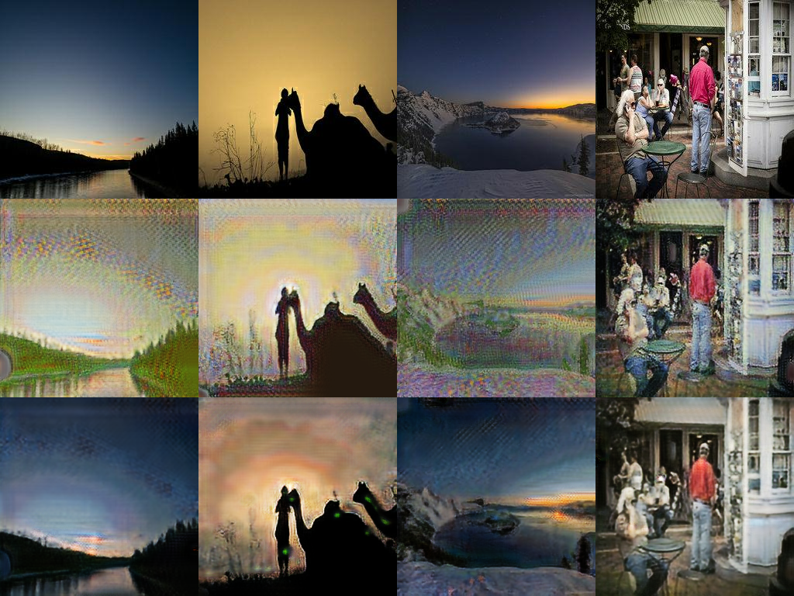
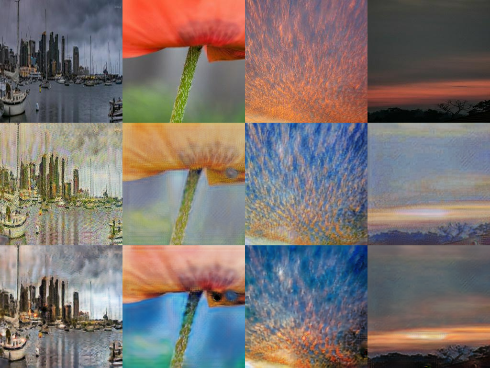
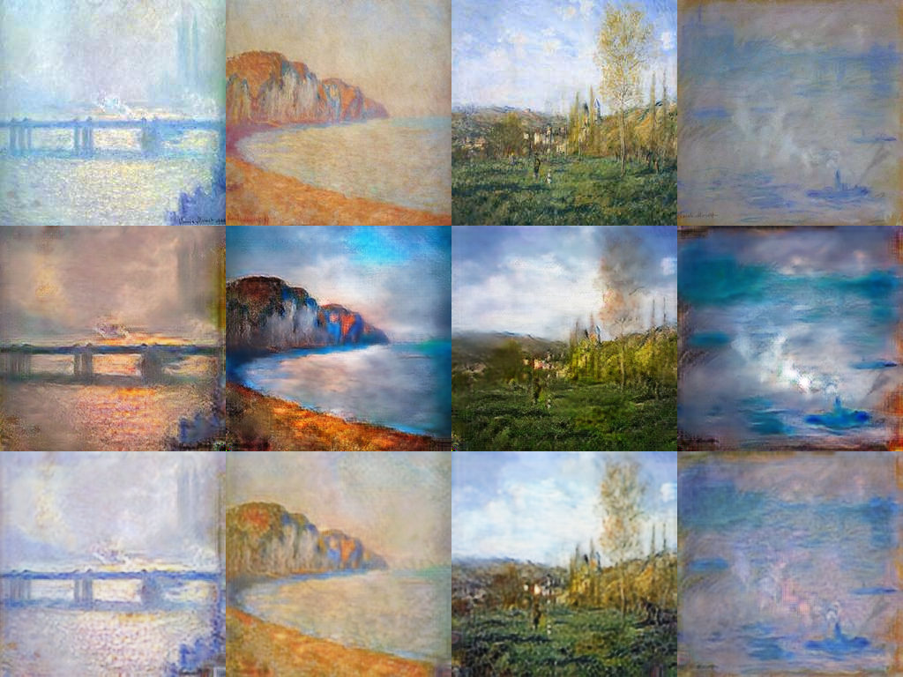

# Task 3 — CycleGAN visual failure analysis · Shibin Thomas

**Model:** run `cyclegan_v1_20261001-201801`, the submitted model: 40 epochs, final weights `checkpoints/cyclegan_v1_20261001-201801/G_AB.pt` and `G_BA.pt`.
**Images:** the 300 Monets (A → B) and the first 300 sorted photos (B → A) that the Kaggle script scores.
**Selection:** `evaluate_local.py` ranks every translation by three automatic criteria:
* highest cycle-reconstruction L1;
* lowest content cosine (Inception features of input vs translation);
* largest nearest-neighbour distance to any real image of the target domain (least realistic).

The four worst images per criterion and direction are saved as grids: input | translation | reconstruction.
I then looked at all 24 grids and the random samples in `final_samples_*.png`, and wrote the
descriptions below myself. The candidate list with per-image numbers is
[`outputs/cyclegan_v1_20261001-201801/failure_candidates.md`](outputs/cyclegan_v1_20261001-201801/failure_candidates.md).

Overall, photo → Monet works on ordinary daylight landscapes and seascapes:
* the scene layout is kept;
* colours shift to Monet's pastel blue / ochre palette;
* the reconstructions are close to the inputs (cycle L1 0.062).

The five failures below are the systematic ones.

---

## Failure 1 — Dark and night photos are washed out into "confetti" texture (photo → Monet)

*Grid `failure_B2A_nn_dist.png`; top = input, middle = translation, bottom = reconstruction.
Inputs: `053024baa2.jpg`, `03a21c1b9c.jpg`, `099159901a.jpg`, `02001e59af.jpg`.*

* **What happens.**
  * The dusk river scene, the camel silhouette at sunset and the lake at twilight are dark, low-contrast
    photos.
  * G_BA lifts them to a bright, washed-out pastel image covered in a dense multicolour stipple. The night
    sky becomes noise, and the silhouette loses its edge.
  * These are the images farthest from any real Monet: NN distance 19.5–20.3, against about 14–17 for
    typical outputs.
* **Why.** The 300 Monets contain almost no night scenes, so D_A has never seen a dark painting. The
  quickest way to look like the training paintings is to brighten the image and add brush-like
  high-frequency texture everywhere. This is a **domain-coverage** problem, not a training bug.
* **Evidence in the metrics.** Photo → Monet precision is only 0.27: only 27% of the generated Monets fall
  inside the real-Monet feature manifold.
* **Testable fix.** DiffAugment's colour/brightness augmentation of D_A's inputs exposes it to darker
  versions of real paintings. This is part of the v2 config.
  * **Measurement:** NN distance and precision on the 50 darkest photos (lowest mean luminance), v1 vs v2.

## Failure 2 — Colours are replaced by Monet's palette, and the cycle "hides" the original (photo → Monet)

*Grid `failure_B2A_cycle_l1.png`. Inputs: harbour skyline `04ec8c9ec2.jpg`, red poppy `0159685c51.jpg`,
orange cloud sky `0845e8dc24.jpg`, red sunset `02ded12bbd.jpg`.*

* **Strongly saturated warm colours get recoloured.**
  * The orange mackerel sky turns **blue**.
  * The red poppy turns pale orange on a lavender background.
  * The red sunset band becomes yellow-grey.

  Monet's palette is dominated by blues, lilacs and soft ochres, so vivid reds and oranges are pulled
  towards it.
* **The reconstruction recovers colours that the translation no longer shows.** The poppy is red again
  after G_AB, and the sky regains orange streaks. This is the known CycleGAN "steganography" effect
  (Chu et al. 2017): the generator encodes the original colour in a faint, almost invisible signal, so
  the cycle loss is satisfied without the translation being faithful.
* **The signal leaves visible traces.** Green dots appear on the camel silhouette's reconstruction in
  Failure 1, and the blue/teal patches in the poppy's reconstruction are wrong.
* **These images have the highest cycle error** of all 300 photos (cycle L1 0.13–0.17, about 2.5× the
  mean of 0.062): when the hidden signal is not enough, the cycle breaks.
* **Testable fix.** A lower identity weight would free the colours; it is in v2 (λ_id 5 → 2.5). The
  opposite option, a perceptual or colour-histogram term on the translation, would keep them.
  * **Measurement:** the cycle L1 of these four images, and the mean absolute hue shift on the 300
    scored photos.

## Failure 3 — Regular stipple / mosaic texture instead of brush strokes (photo → Monet)

*Visible in almost every photo → Monet output: `final_samples_B2A.png` (middle row) and the city
skyline in Failure 2.*

* **What happens.**
  * Flat regions are covered by a fine, regular dot pattern of 2–4 pixels: sky, water, the brick wall
    of the "Heame Gold" building.
  * It looks like pointillist stippling or a mosaic, not like Monet's broad, directional strokes.
  * Tall structures (the skyline masts, the lighthouse) get vertical streaks.
* **Why.** The 70×70 PatchGAN judges local texture only, and "lots of small multicoloured dabs" is a
  cheap texture statistic that fools it. The pattern is not the checkerboard of transposed convolutions;
  I use resize-convolution upsampling, and the period does not match a stride-2 grid. Instead, it is the
  generator's learned texture. It probably also contributes to the high FID, because Inception features
  are sensitive to high-frequency texture.
* **Testable fix.** Generator EMA (in v2) averages away part of the high-frequency noise. A second,
  larger-receptive-field discriminator (multi-scale D) would judge stroke shape, not just dab
  statistics.
  * **Measurement:** high-frequency energy (FFT power above 1/8 of Nyquist) of the outputs vs real Monets.

## Failure 4 — Foggy Monets become saturated "sunsets" or lose objects (Monet → photo)

*Grid `failure_A2B_content_cos.png`. Inputs: `47a0548067.jpg` (Charing Cross Bridge in fog),
`632ddbc784.jpg` (cliffs), `133b42e498.jpg` (Vétheuil landscape), `9963d64ebf.jpg` (fog on the Thames).*

* **Monet's pale, low-contrast fog paintings change mood completely.**
  * Charing Cross Bridge becomes a dark orange sunset.
  * The cliffs get a deep blue sky and turquoise sea.
  * The misty Thames turns into a turquoise "storm".
* **Objects disappear.** The tall poplar in the Vétheuil landscape is replaced by a grey, smoke-like blob.
* **Content is lost.** These images have the lowest content cosine in this direction (0.52–0.55, against
  a mean of 0.79).
* **Why.** There are no fog photos in the photo domain's typical statistics: photos are sharp and
  contrasty. G_AB therefore "explains" the fog by inventing contrast and saturated colour. The poplar is
  thin and painted with the same strokes as the sky, so the generator treats it as texture, not as an
  object.
* **Testable fix.** The identity loss on photos keeps G_AB conservative. A content-preserving term, for
  example the L1 between low-pass filtered input and output, would stop global colour inversions.
  * **Measurement:** content cosine on the 30 lowest-contrast Monets.

## Failure 5 — Monet → photo stays painterly (Monet → photo)

*Visible in `final_samples_A2B.png` (middle row) and `failure_A2B_nn_dist.png`.*

* **What happens.**
  * The translations are sharper and more saturated than the paintings, but brush strokes, the painted
    sky and even Monet's signature (bottom right of several inputs) are still visible.
  * Few outputs would pass for photographs.
* **Evidence in the metrics.** Monet → photo recall is 0.32: the generated photos cover only a third of
  the real-photo manifold. They are too close to "paintings with more contrast".
* **Why.** This direction is harder:
  * only 300 Monets are available as inputs;
  * G_AB must *remove* texture and add photographic detail that is not in the painting;
  * the cycle loss rewards keeping the strokes, because G_BA needs them to reconstruct the painting.
* **Testable fix.** A larger λ_id on photos, or a stronger D_B (multi-scale), pushes harder towards
  photographic texture.
  * **Measurement:** recall and coverage for A2B, v1 vs v2.

---

## Summary

| # | Direction | Failure | Root cause | Testable fix (metric) |
|---|---|---|---|---|
| 1 | photo → Monet | dark / night photos washed out, noisy | no dark paintings in 300 Monets; D_A memorises daylight palette | DiffAugment colour on D_A (precision, NN distance on dark photos) |
| 2 | photo → Monet | warm colours recoloured, cycle "hides" the original colour | Monet palette prior + CycleGAN steganography | lower λ_id / colour term (hue shift, cycle L1 of worst images) |
| 3 | photo → Monet | regular stipple texture instead of strokes | PatchGAN sees only 70×70 texture statistics | EMA, multi-scale D (high-frequency energy, FID) |
| 4 | Monet → photo | fog paintings become saturated, objects lost | photo domain has no fog; thin objects treated as texture | low-pass content term (content cosine) |
| 5 | Monet → photo | outputs stay painterly | removing texture is harder than adding it; cycle rewards keeping strokes | stronger D_B / λ_id (recall, coverage) |

Failures 1–3 are why the v2 configuration (`configs/cyclegan_v2.yaml`, `results.md` §5b) adds DiffAugment,
generator EMA and a lower identity weight.
