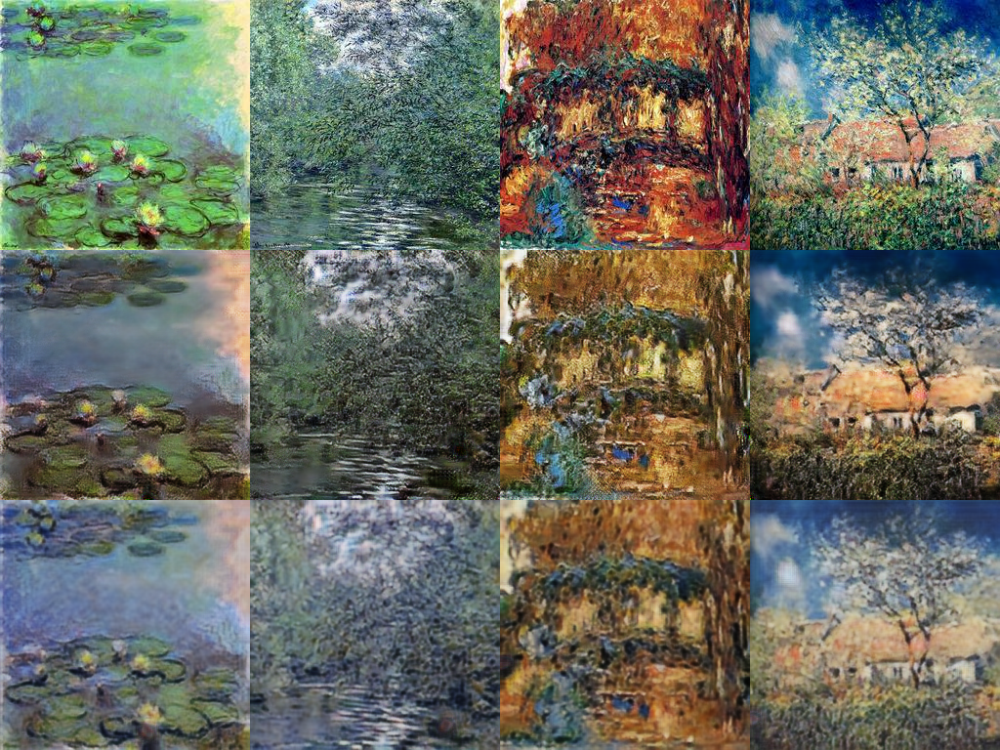
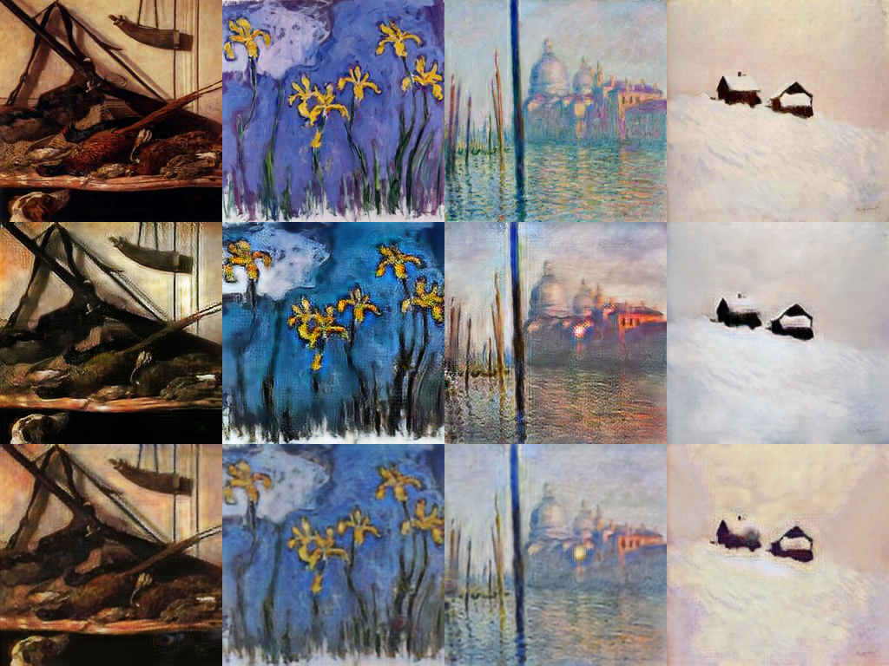

# Visual failure candidates - run `cyclegan_v1_20261001-201801`

Automatically ranked per direction; each grid row = input | translation | reconstruction.

## B2A (photo->monet) - highest cycle-reconstruction error

- `04ec8c9ec2.jpg` cycle L1 0.1690, LPIPS 0.539, content cos 0.748, NN distance 14.55
- `0159685c51.jpg` cycle L1 0.1669, LPIPS 0.447, content cos 0.653, NN distance 17.28
- `0845e8dc24.jpg` cycle L1 0.1402, LPIPS 0.490, content cos 0.674, NN distance 16.18
- `02ded12bbd.jpg` cycle L1 0.1306, LPIPS 0.544, content cos 0.501, NN distance 16.44

## B2A (photo->monet) - lowest content cosine (content lost)

- `06f749912b.jpg` cycle L1 0.0776, LPIPS 0.352, content cos 0.489, NN distance 11.64
- `02ded12bbd.jpg` cycle L1 0.1306, LPIPS 0.544, content cos 0.501, NN distance 16.44
- `065b649ac7.jpg` cycle L1 0.0767, LPIPS 0.582, content cos 0.502, NN distance 14.62
- `00dff09ebe.jpg` cycle L1 0.0609, LPIPS 0.537, content cos 0.529, NN distance 17.21

## B2A (photo->monet) - farthest from any real target image (least realistic)

- `053024baa2.jpg` cycle L1 0.0421, LPIPS 0.766, content cos 0.653, NN distance 20.28
- `03a21c1b9c.jpg` cycle L1 0.0651, LPIPS 0.523, content cos 0.652, NN distance 20.06
- `099159901a.jpg` cycle L1 0.0430, LPIPS 0.775, content cos 0.613, NN distance 19.57
- `02001e59af.jpg` cycle L1 0.0731, LPIPS 0.319, content cos 0.807, NN distance 19.46

## A2B (monet->photo) - highest cycle-reconstruction error

- `aa76c7625a.jpg` cycle L1 0.0958, LPIPS 0.413, content cos 0.744, NN distance 16.75
- `4f7e01f097.jpg` cycle L1 0.0944, LPIPS 0.494, content cos 0.802, NN distance 12.95
- `6782e7cb2a.jpg` cycle L1 0.0901, LPIPS 0.422, content cos 0.748, NN distance 15.34
- `f486c1655f.jpg` cycle L1 0.0875, LPIPS 0.486, content cos 0.822, NN distance 11.92

## A2B (monet->photo) - lowest content cosine (content lost)

- `47a0548067.jpg` cycle L1 0.0576, LPIPS 0.559, content cos 0.518, NN distance 13.38
- `632ddbc784.jpg` cycle L1 0.0300, LPIPS 0.503, content cos 0.530, NN distance 10.60
- `133b42e498.jpg` cycle L1 0.0439, LPIPS 0.303, content cos 0.545, NN distance 11.49
- `9963d64ebf.jpg` cycle L1 0.0379, LPIPS 0.402, content cos 0.551, NN distance 14.35

## A2B (monet->photo) - farthest from any real target image (least realistic)

- `8ee2933868.jpg` cycle L1 0.0501, LPIPS 0.243, content cos 0.738, NN distance 19.48
- `28deb43a71.jpg` cycle L1 0.0641, LPIPS 0.309, content cos 0.852, NN distance 19.47
- `19dc36ccb2.jpg` cycle L1 0.0394, LPIPS 0.344, content cos 0.820, NN distance 19.18
- `910610e827.jpg` cycle L1 0.0259, LPIPS 0.222, content cos 0.738, NN distance 18.55
