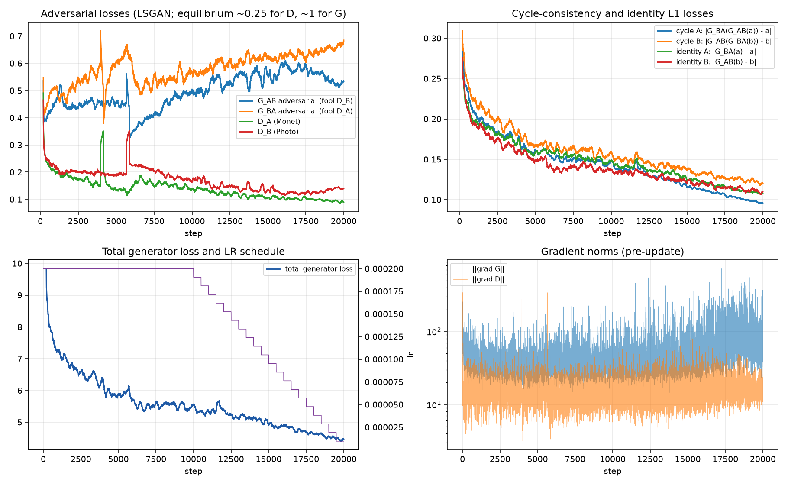
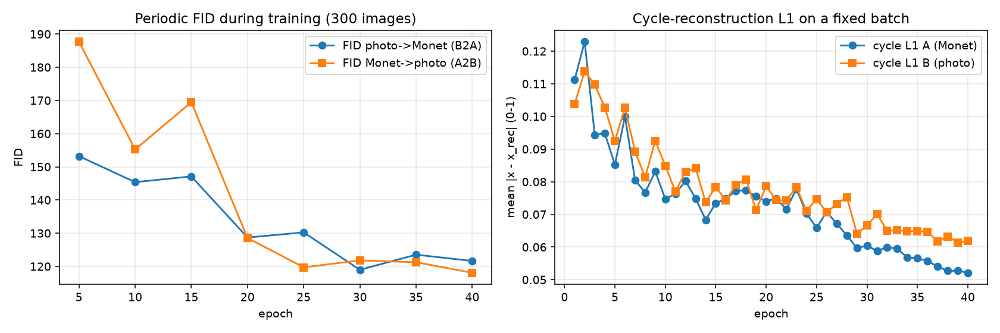
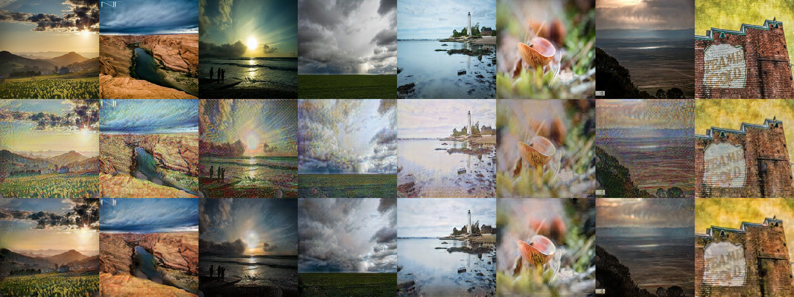
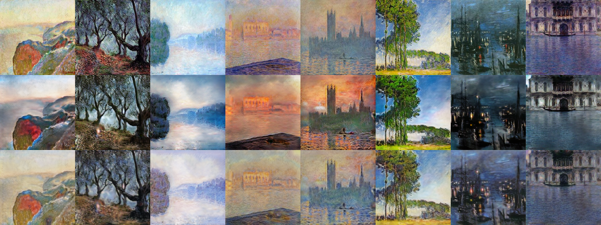

# Task 3 — CycleGAN image style transfer (Monet ↔ Photo) · Shibin Thomas

Unpaired image-to-image translation between **A = Monet paintings** (300) and **B = photos** (7,038) with a CycleGAN
implemented and trained **from scratch**. Domain naming follows the instructor's evaluation script:
* `pred_A2B` = Monet → Photo (generated photos);
* `pred_B2A` = Photo → Monet (generated Monets).

| | |
|---|---|
| Configs | [`configs/cyclegan_v1.yaml`](configs/cyclegan_v1.yaml) (baseline) · [`configs/cyclegan_v2.yaml`](configs/cyclegan_v2.yaml) (improved, §5b) |
| Code / notebook | [`src/`](src/) · [`src/task3_cyclegan.ipynb`](src/task3_cyclegan.ipynb) · [`evaluate_local.py`](evaluate_local.py) |
| Predictions | [`outputs/pred_A2B/`](outputs/pred_A2B/), [`outputs/pred_B2A/`](outputs/pred_B2A/) (run id in `outputs/predictions_info.json`) |
| Kaggle file | [`submission.csv`](submission.csv) · leaderboard: [`kaggle_leaderboard.json`](kaggle_leaderboard.json) |
| All metrics | [`full_metrics_report.csv`](full_metrics_report.csv) (= `metrics_report.csv`) |
| Plots | `outputs/<run_id>/` loss_curves, epoch_curves, final_samples_*, failure_*, samples/epoch_*.png |
| Human audit | `outputs/human_audit/` (panels S01–S30, rater sheets, results) |
| Raw logs / manifest | `reproducibility/raw_logs/task3_gan/shibin_thomas/<run_id>/`, `reproducibility/manifests/task3_gan/shibin_thomas/<run_id>.json` |

## 1. Data: two unpaired domains (3.1.1)

| Domain | Folder | Images | Size |
|---|---|---|---|
| A — Monet paintings | `task3_gan/data/monet_jpg` | 300 | 256×256 RGB |
| B — photos | `task3_gan/data/photo_jpg` | 7,038 | 256×256 RGB |

* The class dataset zip also contained macOS metadata (`__MACOSX/`, `.DS_Store`). These were removed: they
  are not images and would break the image loaders.
* The images are not committed: the repository is public. Their file list is fingerprinted with SHA-256 in
  the run manifest.
* **Unpaired sampling.** Each step draws an independent Monet and photo; there is no correspondence
  between them. Monets are drawn from shuffled permutations, so all 300 paintings are used equally often;
  photos are drawn from shuffled permutations of all 7,038. One epoch = 2,000 pairs.
* **Augmentation** (CycleGAN "resize and crop"): bicubic resize to 286, random 256×256 crop, random
  horizontal flip; pixels scaled to [−1, 1] to match the generators' tanh output.
* **Imbalance (300 vs 7,038).** This is the main data challenge. Only 300 Monets define the target style,
  so D_A sees each painting about 267 times; augmentation and the image pool reduce memorisation.

## 2. Architecture (3.1.2) — two generators, two discriminators

| Network | Structure | Parameters |
|---|---|---|
| `G_AB` (Monet→Photo), `G_BA` (Photo→Monet) | c7s1-64 → d128 → d256 → **9 residual blocks** (256 ch, at 64×64) → up128 → up64 → c7s1-3 → tanh; InstanceNorm, ReLU, reflection padding | ≈ 11.4 M each |
| `D_A` (real/fake Monet), `D_B` (real/fake photo) | **70×70 PatchGAN**: C64 – C128 – C256 – C512 – 1 (4×4 convs, LeakyReLU 0.2, InstanceNorm except on the first layer); 30×30 output map for a 256×256 input | ≈ 2.77 M each |

Exact counts are in `full_metrics_report.csv`.

**Design choices and why:**
* **ResNet generator with 9 residual blocks** (Johnson et al. 2016), the standard choice for 256×256
  CycleGAN. Style transfer must keep the scene layout while changing texture and colour. Residual blocks
  carry the content through and let each block learn a correction, which suits "same scene, different style".
* **Resize-convolution upsampling** (nearest-neighbour ×2, then a 3×3 conv) instead of the paper's
  transposed convolutions. Transposed convolutions with stride 2 overlap unevenly and produce checkerboard
  artifacts (Odena et al. 2016), which are very visible in flat sky and water regions. This is my main
  architectural difference from the reference implementation; `model.upsample: deconv` restores the
  original.
* **InstanceNorm instead of BatchNorm.** Normalising each image separately removes image-specific contrast,
  which is the right inductive bias for style transfer (Ulyanov et al. 2016). It also works with small
  batches (4).
* **Reflection padding** avoids dark border artifacts at image edges.
* **70×70 PatchGAN.** It judges local texture (brush strokes, colour patches) rather than global layout,
  with far fewer parameters than a full-image discriminator; the cycle loss takes care of global structure.
* **Initialisation:** all weights N(0, 0.02), no pretrained weights.

## 3. Losses and training (3.1.3)

With a = real Monet and b = real photo:

| Term | Formula | Weight | Purpose |
|---|---|---|---|
| Adversarial (LSGAN), generators | (D_B(G_AB(a)) − 1)² + (D_A(G_BA(b)) − 1)² | 1 | make translations look like the target domain |
| Cycle consistency | ‖G_BA(G_AB(a)) − a‖₁ + ‖G_AB(G_BA(b)) − b‖₁ | λ_cyc = 10 | translation must be invertible, so content is preserved (no mode collapse to one image) |
| Identity | ‖G_BA(a) − a‖₁ + ‖G_AB(b) − b‖₁ | λ_id = 5 (= 0.5 λ_cyc) | an image already in the target domain should not change; preserves colour composition (used by Zhu et al. for paintings) |
| Discriminators (LSGAN) | ½[(D(real) − 1)² + D(pool(fake))²] | — | D_A and D_B trained against a 50-image history pool of fakes |

| Hyperparameter | Value | Reason |
|---|---|---|
| Optimiser | Adam, lr 2e-4, β = (0.5, 0.999), for G and D | the CycleGAN / DCGAN setting; β1 = 0.5 damps momentum oscillations in adversarial training |
| LR schedule | constant for 20 epochs, then linear decay to 0 over 20 epochs | as in Zhu et al.; decay lets the adversarial game settle |
| Epochs × pairs | 40 × 2,000 = 80,000 unpaired pairs (20,000 steps of batch 4) | each Monet is seen about 267 times, each photo about 11 times; enough for the style to converge within the GPU budget |
| Batch size | 4 | better GPU use than the paper's batch of 1; InstanceNorm makes the results independent of batch statistics |
| LSGAN instead of BCE | — | smoother gradients for samples far from the decision boundary, more stable training (Mao et al. 2017) |
| Image pool | 50 | discriminators also see older fakes, which reduces generator/discriminator oscillation (Shrivastava et al. 2017) |
| Precision | fp32 with TF32 matmuls | GAN losses are sensitive to bf16 rounding; TF32 is fast on the RTX 5090 and keeps fp32 range |
| Monitoring | every step: all loss terms, gradient norms of G and D, NaN check; every epoch: cycle L1 on a fixed batch, sample grid; every 5 epochs: FID in both directions | evidence for the convergence and stability analysis |

## 4. Results

The Kaggle score uses the instructor's protocol: first 300 sorted images, Inception-v3 features, FID and the
script's "MiFID" (mean paired cosine distance), averaged over both directions. All other metrics come from
`gan_metrics.py`; their definitions are in that file's docstring.

<!-- METRICS:START -->
_Auto-generated by `evaluate_local.py` from run `cyclegan_v1_20261001-201801` (source `outputs/cyclegan_v1_20261001-201801/full_metrics_report.csv`)._

**Kaggle submission (instructor protocol, average of both directions): FID = 117.707, MiFID = 0.4217**

| Metric | B2A (photo->monet) | A2B (monet->photo) |
|---|---|---|
| n_real | 300 | 300 |
| n_generated | 300 | 300 |
| fid | 118.0711 | 117.3427 |
| mifid_script | 0.4105 | 0.4330 |
| kid | 0.0197 | 0.0362 |
| kid_std | 0.0025 | 0.0040 |
| precision | 0.2667 | 0.6067 |
| recall | 0.6400 | 0.3200 |
| density | 0.2207 | 0.8360 |
| coverage | 0.5233 | 0.7567 |
| cycle_l1 | 0.0622 | 0.0531 |
| lpips_input_vs_translation | 0.4508 | 0.3664 |
| lpips_input_vs_reconstruction | 0.3837 | 0.4678 |
| content_cosine_similarity | 0.7501 | 0.7943 |

| Training statistic | Value |
|---|---|
| final_epoch_mean_loss_G | 4.4581 |
| final_epoch_mean_gan_A2B | 0.5283 |
| final_epoch_mean_gan_B2A | 0.6748 |
| final_epoch_mean_cyc_A | 0.0963 |
| final_epoch_mean_cyc_B | 0.1204 |
| final_epoch_mean_idt_A | 0.1080 |
| final_epoch_mean_idt_B | 0.1096 |
| final_epoch_mean_loss_D_A | 0.0895 |
| final_epoch_mean_loss_D_B | 0.1394 |
| grad_norm_G_mean | 48.2900 |
| grad_norm_G_p99 | 180.9956 |
| grad_norm_G_max | 726.9405 |
| grad_norm_D_mean | 17.0936 |
| grad_norm_D_p99 | 39.7193 |
| grad_norm_D_max | 342.0790 |
| nonfinite_steps | 0 |
| params_total | 28,285,832 |
| params_generators | 22,756,358 |
| params_discriminators | 5,529,474 |
| training_time_sec | 5471.4195 |
| train_images_per_sec | 36.0143 |
| train_pairs_per_sec | 18.0072 |
| total_steps | 20,000 |
| epochs | 40 |
| training_time_min | 91.1903 |
| peak_cpu_rss_mb | 3568.6289 |
| peak_gpu_allocated_mb | 19921.7041 |
| peak_gpu_reserved_mb | 20980.0000 |
| hardware | NVIDIA GeForce RTX 5090 |

GPU state at start of training: `NVIDIA GeForce RTX 5090, 15463 MiB, 32607 MiB, 30 % | 34 processes on the GPU (1 python, 17 not visible to this user); programs: AlienFXSubAgent.exe, CrossDeviceResume.exe, Killer.exe, Notepad.exe, PhoneExperienceHost.exe, SearchHost.exe, ShellExperienceHost.exe, ShellHost.exe, StartMenuExperienceHost.exe, WindowsTerminal.exe, chrome.exe, explorer.exe, msedge.exe, msedgewebview2.exe, python.exe`

_Human audit: pending (see `outputs/human_audit/INSTRUCTIONS.md`)._

| Kaggle leaderboard | value |
|---|---|
| team_name | to fill in kaggle_leaderboard.json |
| public_score | to fill in kaggle_leaderboard.json |
| private_score | to fill in kaggle_leaderboard.json |
| public_rank | to fill in kaggle_leaderboard.json |
| private_rank | to fill in kaggle_leaderboard.json |
<!-- METRICS:END -->

## 5. Training behaviour, convergence and stability (3.1.5, 3.2.3)

Sources:
* `outputs/cyclegan_v1_20261001-201801/loss_curves.png` and `epoch_curves.png`;
* `reproducibility/raw_logs/task3_gan/shibin_thomas/cyclegan_v1_20261001-201801/steps.csv` and `epochs.csv`.

| Epoch | 5 | 10 | 15 | 20 | 25 | 30 | 35 | 40 |
|---|---|---|---|---|---|---|---|---|
| FID photo→Monet (B2A) | 153.1 | 145.4 | 147.1 | 128.7 | 130.2 | **119.0** | 123.5 | 121.6 |
| FID Monet→photo (A2B) | 187.7 | 155.3 | 169.5 | 128.7 | 119.7 | 121.8 | 121.3 | **118.1** |

**Generator/discriminator balance.**
* Both discriminators quickly settle below the LSGAN balance point of 0.25, and keep falling slowly:
  * D_A (Monet) ends at 0.089, D_B (photo) at 0.139.
  * The generators' adversarial losses rise from about 0.40 to 0.53 (G_AB) and 0.68 (G_BA).
* The discriminators gradually win the game, and **D_A wins most**. With only 300 paintings it starts to
  memorise them. This is the main motivation for DiffAugment in v2 (§5b).
* There are two short oscillations, at about step 4,000 (D_A jumps to 0.35 while G_BA's loss drops) and
  step 5,700 (D_B jumps to 0.30 while G_AB's loss drops). Both recover within a few hundred steps. The
  image pool damps these swings.

**Cycle and identity losses** fall smoothly over the whole run:
* cycle A 0.30 → 0.096;
* cycle B 0.31 → 0.120;
* identity terms 0.29 → 0.11.

The fixed-batch reconstruction L1 halves: A 0.111 → 0.052, B 0.104 → 0.062. The generators keep learning to
invert each other even after FID stops improving.

**Convergence by FID.**
* Most of the improvement happens in the first 25 epochs (B2A 153 → 130, A2B 188 → 120).
* From epoch 25 to 40, FID only moves within ±4 of 120. Differences that small are within the sampling
  noise of a 300-image FID.
* The linear learning-rate decay (epochs 21–40, staircase in the bottom-left panel) mainly lowers the
  cycle/identity losses and makes the sample grids sharper. It does not lower FID further.
* The recipe therefore had **converged at about FID 120**, so more epochs of the same recipe would not
  help. This is the evidence behind the v2 changes.

**Stability.**
* No non-finite step in 20,000 steps.
* Pre-clip gradient norms: G mean 48 (p99 181, max 727); D mean 17 (p99 40, max 342).
* The generator norm drifts upward during LR decay, as the discriminators' gradients sharpen. Adam's
  normalisation keeps the effective step bounded, and no loss spike followed.

**Cost.**
* Training: 91.2 minutes on the RTX 5090 at 36 images/s; the GPU was shared with another job (logged in
  the manifest).
* Peak memory: 19.9 GB allocated, mostly for the periodic Inception evaluation.

## 5b. From v1 to v2: changes aimed at v1's measured weaknesses

The baseline run (`cyclegan_v1_20261001-201801`) scored **FID 117.71 and MiFID 0.4217** under the instructor
protocol. Kaggle score (FID + MiFID) / 2 = **59.06**. Its logs showed three problems:

| v1 evidence | What it means |
|---|---|
| FID stopped improving from epoch 30 to 40 (B2A 119.0 → 123.5 → 121.6, A2B 121.8 → 121.3 → 118.1) | more epochs of the same recipe would not help |
| D_A loss fell steadily to 0.089, far below the LSGAN balance point of 0.25, while D_B stayed at 0.14 | D_A, which has only 300 paintings, was memorising them, and memorised paintings give the generator weak, noisy gradients |
| Photo→Monet precision 0.27 (only 27% of generated Monets lie inside the real-Monet feature manifold) | the Monet style was too weak or unrealistic; the identity loss (λ_id = 5) also pulls G_BA towards returning the photo unchanged |

v2 keeps the architecture and changes only the training procedure:

| Change | v1 → v2 | Why |
|---|---|---|
| DiffAugment (Zhao et al. 2020) | off → D_A: colour + translation + cutout; D_B: translation | the standard fix for discriminator overfitting with little data: every image D sees, real or fake, gets the same random differentiable augmentation, so D cannot memorise the 300 paintings and the augmentation does not leak into the generated images; D_B has 7,038 photos, so only light augmentation |
| Generator EMA (Karras et al. 2018; Yazıcı et al. 2019) | off → decay 0.999 | GAN weights oscillate around the equilibrium; an exponential moving average of the generator weights is a smoother generator that consistently gets lower FID; the EMA copy is the one exported |
| λ_identity | 5 → 2.5 | lets G_BA depart further from the input photo's colours, to address the low precision; still non-zero, so the colour composition is kept |
| Epochs | 20 + 20 → 30 + 30 | with D_A no longer overfitting, longer training can keep improving |
| Exported epoch | final epoch → best held-out epoch | from epoch 30 on, every 2 epochs, the EMA generators are scored with FID on **held-out data**: sorted photos 300–599 as Photo→Monet inputs and as Monet→Photo references, against all 300 Monets. The epoch with the lowest mean FID is exported. The 300 photos the evaluation scores (0–299) are never used for this choice. The selection curve is in `epoch_curves.png` and the `sel_*` columns of `epochs.csv` |

What stays the same, as the integrity rules require:
* the submitted images are the direct, unedited outputs of one trained generator per direction;
* no image is hand-picked, and no pretrained model generates or touches the images;
* the only choice made is *which epoch's weights* to use, by a rule fixed in the config before training.

The comparison of the two runs is in §4 (METRICS) and in `outputs/<run_id>/full_metrics_report.csv` for each run.

## 6. Cycle-consistency verification (3.2.2)

* **Code level.** `tests/test_task3.py` checks that the cycle and identity terms are wired correctly
  (perfect reconstruction gives exactly 0), and that optimising the cycle loss alone drives the
  reconstruction error down.
* **Model level.** For the trained model, `evaluate_local.py` reports the cycle-reconstruction L1 and the
  LPIPS between each input and its reconstruction G_back(G(x)), in both directions. The third row of
  `final_samples_*.png` shows the reconstructions next to the inputs.

**Interpretation for the submitted model** (`full_metrics_report.csv`):

| | photo → Monet → photo | Monet → photo → Monet |
|---|---|---|
| Cycle L1 (pixels in [0, 1]) | 0.062 | 0.053 |
| LPIPS input vs reconstruction | 0.384 | 0.468 |
| LPIPS input vs translation | 0.451 | 0.366 |

* **The pixel error is small.** On average, a reconstructed pixel is off by 5–6% of the intensity
  range, and the third row of `final_samples_*.png` shows reconstructions with the same layout,
  objects and colours as the inputs. The cycle constraint works, and neither generator collapsed to a
  constant output.
* **The perceptual error is larger than the pixel error.**
  * The LPIPS between input and reconstruction (0.38–0.47) is close to the LPIPS between input and
    translation. The reconstructions are blurrier and lose fine texture, which LPIPS penalises much more
    than L1.
  * In the Monet → photo → Monet cycle, LPIPS (0.47) is even higher than for the translation itself
    (0.37): the painted brush texture is not fully restored.
* **The cycle is sometimes satisfied by "hiding" information.** The worst cycle errors (L1 0.13–0.17)
  are photos with saturated reds and oranges. Their translation is recoloured, yet the reconstruction
  recovers the colour: the steganography effect described in `failure_analysis.md` (Failure 2).
* **Conclusion.** Cycle consistency holds at the pixel level, but it does not guarantee a faithful
  translation.

## 7. Visual quality, human audit and discussion (3.2.1, 3.2.4, 3.2.6)

**Visual quality** (`final_samples_B2A.png`, `final_samples_A2B.png`, 8 random scored images each):
* **Photo → Monet.**
  * The scene layout is always kept, and colours move convincingly to Monet's pastel palette: blue-lilac
    skies, ochre fields, soft reflections on water.
  * Daylight landscapes and seascapes (the lighthouse, the river valley, the brick building) are the best
    cases.
  * The weaknesses (`failure_analysis.md`): a regular stipple texture instead of brush strokes; washed-out
    dark or night photos; and saturated reds and oranges replaced by blue.
* **Monet → photo.**
  * Outputs are sharper, more contrasty and more saturated, for example the Houses of Parliament with an
    orange sky and the night harbour.
  * But they keep visible brush strokes, painted skies and sometimes Monet's signature, so they remain
    "photo-like paintings". This matches the low recall (0.32).

**What the numbers say.**
* FID is almost identical in both directions (118.1 vs 117.3), but the error profiles differ:
  * photo → Monet has high recall (0.64) but low precision (0.27): diverse outputs, many of them not
    realistic Monets;
  * Monet → photo has the opposite pattern (precision 0.61, recall 0.32): realistic-looking textures,
    but low diversity.
* KID (unbiased, more reliable with 300 images) ranks photo → Monet better (0.020 vs 0.036).
* Content cosine (0.75 / 0.79) shows that most of each input's semantic content survives.

**Human audit.**
* The blinded pack is ready in `outputs/human_audit/`: 30 fixed samples, 15 per direction, shuffled IDs
  S01–S30.
* The two team raters score style, content and artifacts from 1 to 5 in `rater1.csv` / `rater2.csv`.
* `src/human_audit.py score` then adds the means and Cohen's κ to `metrics_report.csv` and §4.
  * Status: pending until both raters have finished.

**Discussion.**
* **Strengths.**
  * A stable from-scratch CycleGAN: no divergence, no mode collapse.
  * Good content preservation.
  * A fully reproducible pipeline whose Kaggle numbers match the instructor's script exactly.
* **Weaknesses.**
  * Photo → Monet realism (precision 0.27) and Monet → photo diversity (recall 0.32).
  * Texture artifacts.
  * Discriminator overfitting on the 300 paintings.
* **Limitations.**
  * FID on only 300 images has a large bias and variance (±3–4 between neighbouring epochs).
  * Single seed.
  * The Kaggle "MiFID" in the instructor script is a mean paired cosine distance between *unrelated*
    real and generated images, so it barely varies between models (0.41–0.43). The score is driven
    almost entirely by FID.
* **Next steps.** These are implemented in `configs/cyclegan_v2.yaml` (§5b): DiffAugment, generator EMA,
  λ_id 2.5, 60 epochs and held-out epoch selection. A multi-scale discriminator would address the stroke
  texture.

## 8. Kaggle submission (3.2.5)

`submission.csv` is produced by `evaluate_local.py` from the direct outputs of my generators. There is no
editing, selection or external model, and the scored images are the deterministic translations of the first
300 sorted images of each domain. After uploading it to the class competition, the team name, public and
private score and rank are recorded in `kaggle_leaderboard.json`.

## 9. Comparison with teammates (team)

| Member | Generator | Discriminator | Losses (λ_cyc / λ_id) | Training | FID (avg) | KID B2A | Human audit |
|---|---|---|---|---|---|---|---|
| Shibin Thomas | ResNet-9, resize-conv upsampling | 70×70 PatchGAN | LSGAN + cycle 10 + identity 5 | 40 epochs × 2,000 pairs, batch 4 | 117.71 | 0.0197 | pending |
| _teammate_ | | | | | | | |

## References
* Zhu, Park, Isola & Efros, *Unpaired Image-to-Image Translation using Cycle-Consistent Adversarial Networks*, ICCV 2017.
* Johnson, Alahi & Fei-Fei, *Perceptual Losses for Real-Time Style Transfer and Super-Resolution*, ECCV 2016.
* Isola et al., *Image-to-Image Translation with Conditional Adversarial Networks* (PatchGAN), CVPR 2017.
* Mao et al., *Least Squares Generative Adversarial Networks*, ICCV 2017.
* Shrivastava et al., *Learning from Simulated and Unsupervised Images through Adversarial Training* (image pool), CVPR 2017.
* Odena, Dumoulin & Olah, *Deconvolution and Checkerboard Artifacts*, Distill 2016.
* Ulyanov, Vedaldi & Lempitsky, *Instance Normalization: The Missing Ingredient for Fast Stylization*, 2016.
* Heusel et al., *GANs Trained by a Two Time-Scale Update Rule Converge to a Local Nash Equilibrium* (FID), NeurIPS 2017.
* Bińkowski et al., *Demystifying MMD GANs* (KID), ICLR 2018.
* Kynkäänniemi et al., *Improved Precision and Recall Metric for Assessing Generative Models*, NeurIPS 2019.
* Naeem et al., *Reliable Fidelity and Diversity Metrics for Generative Models* (density / coverage), ICML 2020.
* Chu, Zhmoginov & Sandler, *CycleGAN, a Master of Steganography*, NeurIPS 2017 workshop.
* Zhao et al., *Differentiable Augmentation for Data-Efficient GAN Training*, NeurIPS 2020.
* Zhang et al., *The Unreasonable Effectiveness of Deep Features as a Perceptual Metric* (LPIPS), CVPR 2018.
